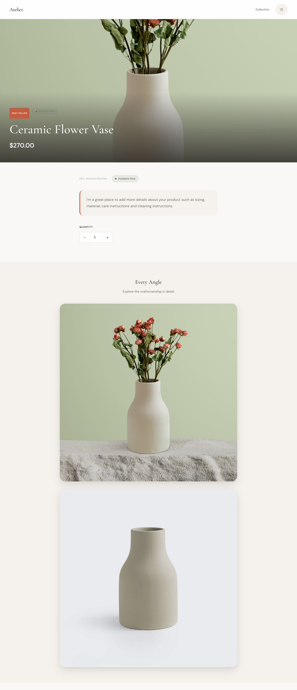
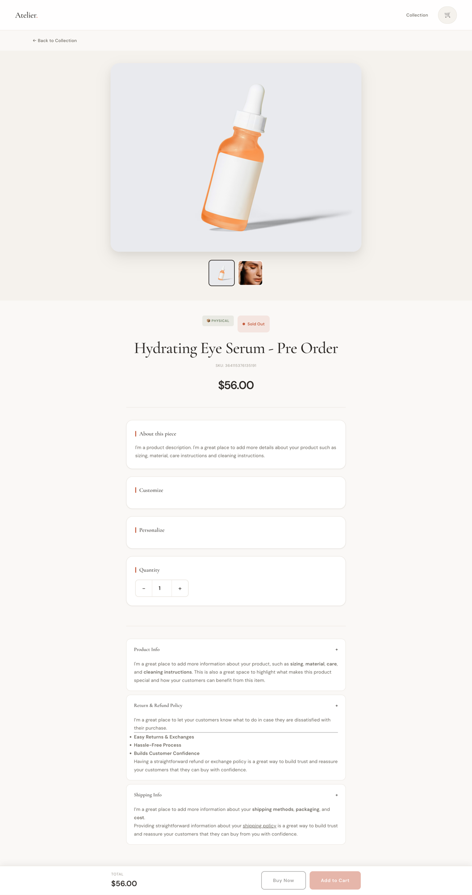
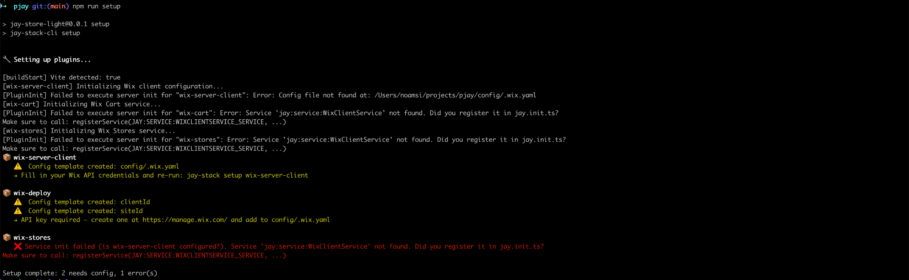
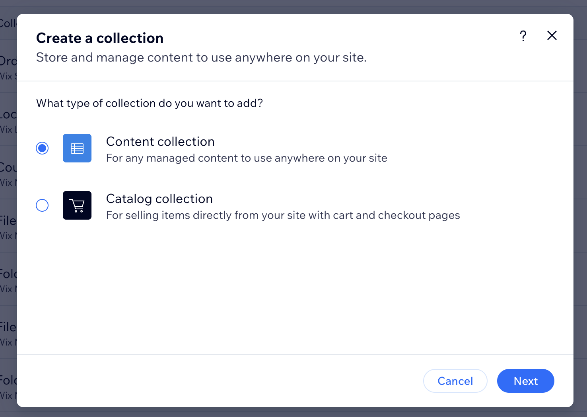
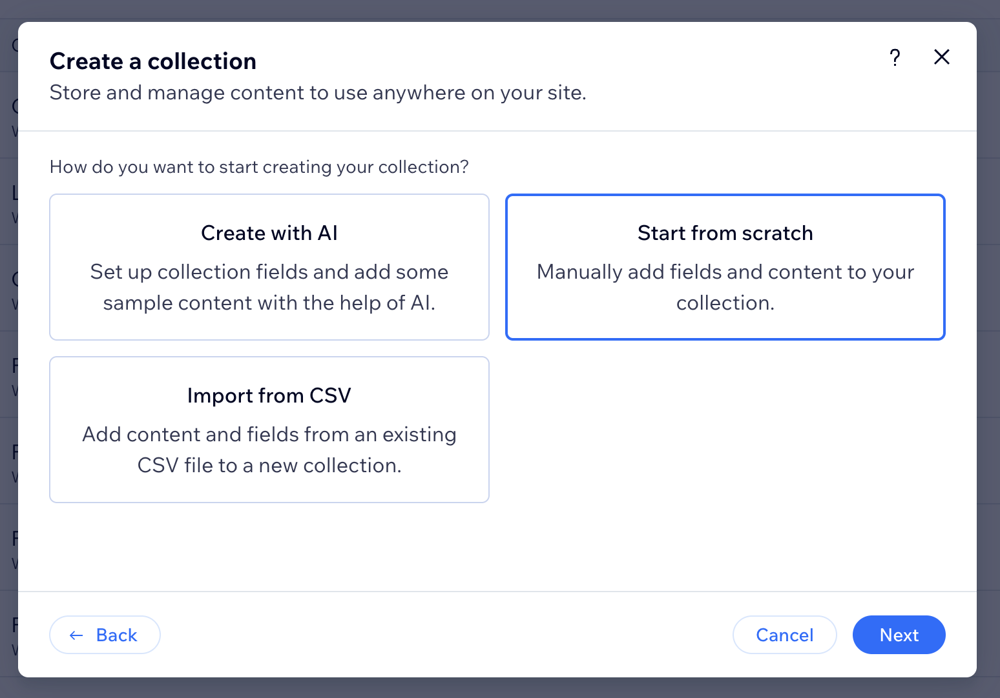
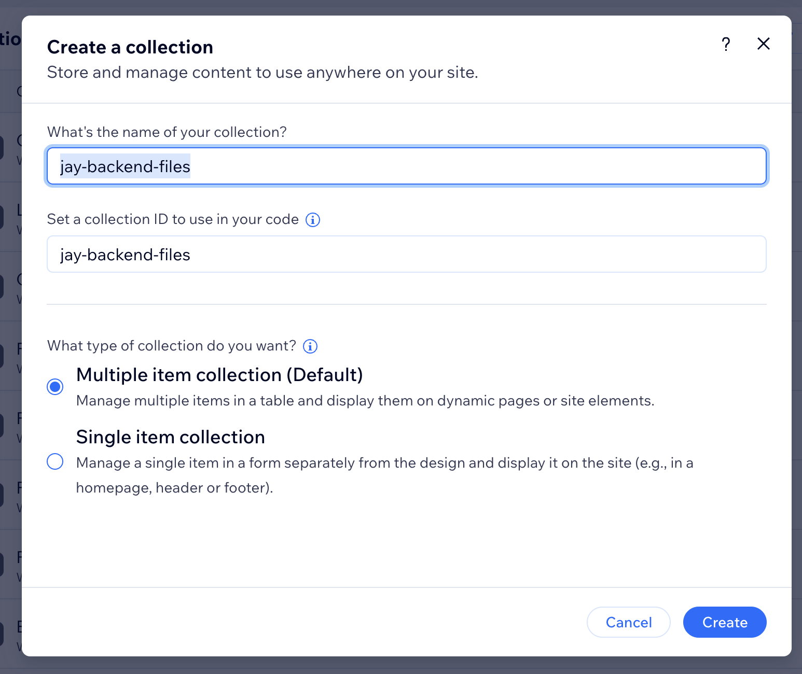
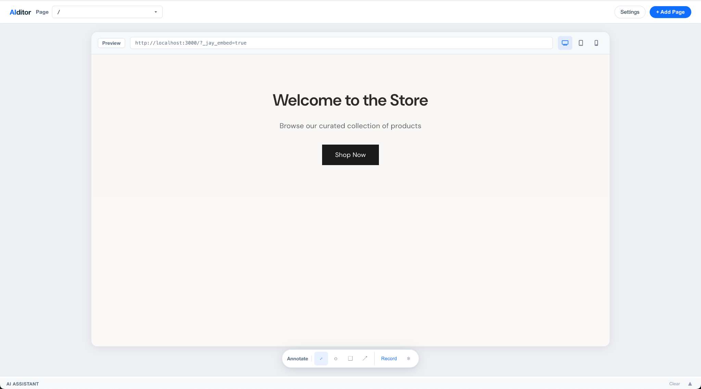

# Jay Wix Store — Light

A minimal e-commerce storefront built with [Jay Framework](https://github.com/jay-framework/jay) and Wix Stores. Features product listing, product detail pages with variants, and a shopping cart.

**Live demo:** [jay-store-736aca87-yoav68.wix-site-host.com](https://jay-store-736aca87-yoav68.wix-site-host.com)

<p>
  
  
  
</p>

## Prerequisites

- Node.js >= 20
- A Wix account (a new site is created automatically in step 1)

## 1. Setup

Run these commands in order:

```bash
npm install
npm create @wix/new@latest init
npm run setup
```

Here's what each command does:

1. **`npm install`** — Installs project dependencies.

2. **`npm create @wix/new@latest init`** — Creates a new headless Wix site and generates `wix.config.json` with:
   - `siteId` — the Wix site identifier (also known as metasite ID in Wix)
   - `appId` — a client ID for headless API access

   This command is only required for Wix-hosted sites.

3. **`npm run setup`** — Creates `config/.wix.yaml` and validates plugin configuration. On the **first run**, this will report errors — **that is expected**. It creates a config template that you fill in during the steps below.

   

### Configure Wix credentials

Complete these steps, then run `npm run setup` again at the end to validate everything.

> **Note:** `appId` (in `wix.config.json`) and `clientId` (in `config/.wix.yaml`) are the same value. Both can also be generated manually from **Wix Dashboard → Site Settings → Headless Settings → Headless Client**.

#### a. Find your new Wix site

`npm create @wix/new@latest init` creates a new site on your Wix account. Open [manage.wix.com/studio/sites](https://manage.wix.com/studio/sites) to find it. All steps below apply to **this site**.

#### b. Generate an API key

1. Go to [manage.wix.com/account/api-keys](https://manage.wix.com/account/api-keys).
2. Create a new API key.
3. Paste it into `config/.wix.yaml` under `apiKeyStrategy.apiKey`.

   > **Note:** Wix may not let you scope an API key to a single headless site. If site-specific permissions are unavailable, grant access to **all sites** on your account.

#### c. Install Wix Stores

In your site's **Business Manager → Apps → Manage Apps → App Market**, find **Wix Stores** and add it.

#### d. Create the `jay-backend-files` collection

In the same site's **CMS**, create a new collection for Wix BaaS deployment. No specific schema is required — only the name matters.

1. Choose **Content collection** (not Catalog collection):

   

2. Choose **Start from scratch**:

   

3. Set the collection name to **`jay-backend-files`** (the collection ID will auto-fill to match). Keep **Multiple item collection** (the default), then click **Create**:

   

#### e. Validate setup

```bash
npm run setup
```

When everything is configured, the output should look like:

```
📦 wix-server-client
   ✅ Services verified
   Wix client connected (site: 04cf42a4...)

📦 wix-deploy
   ✅ Services verified
   Deploy target: wix.config.json (appId: 574c2287...). Collection: jay-backend-files ✓

📦 wix-stores
   ✅ Services verified
   Wix Stores configured (product URL: /products/{slug})

Setup complete: 3 configured
```

### Why two credential files?

| File               | Purpose                                                                                                                             |
|--------------------|-------------------------------------------------------------------------------------------------------------------------------------|
| `wix.config.json`  | Used for **Wix BaaS deployment** — only needed on the server where the application is deployed. Required only for Wix-hosted sites. |
| `config/.wix.yaml` | Used to **connect to Wix backend** services (Wix Data, Wix Stores, etc.) at build time and runtime.                                 |

Having two separate files allows deploying multiple versions of the business as different BaaS instances. By default, both point to the same site.

## 2. Generate Agent Kit

```bash
npm run agent-kit
```

Generates an `agent-kit/` directory with documentation and reference material for the AI agent. The kit is organized by role:

```
agent-kit/
├── plugins-index.yaml              # Index of all installed plugins, their contracts, actions, services, and contexts
├── designer/                       # Jay-HTML syntax, styling, components, and routing for visual design
├── developer/                      # Page contracts, component data/state/refs, CLI commands, and configuration
├── devops/                         # Production builds, serving modes, fetch handler, and cache invalidation
├── plugin/                         # Plugin structure, actions, commands, services, webhooks, and validation
├── materialized-contracts/
│   └── wix-stores/
│       └── product-page.jay-contract   # Fully resolved product page contract with all fields
└── references/
    └── wix-stores/
        └── categories.yaml         # Store categories reference data
```

Each role directory includes an `INSTRUCTIONS.md` entry point for the AI agent.

## 3. Dev Server

```bash
npm run dev
```

The dev server starts at `http://localhost:3000` with hot reload. If port 3000 is taken, it will pick another port and print the URL in the output.

## 4. AI Designer (Aiditor)

The project includes the Jay AI designer for editing pages visually with AI assistance.

```bash
npm run dev
```

Then open `http://localhost:3000/aiditor` in your browser.



1. **Navigate between pages** using the site itself within the preview, or using the top routes selector dropdown.
2. **Annotate visually** using the point, area, or arrow tools to give visual instructions to the agent. You can also paste images into the annotation instructions.
3. **Use the bottom Agent Output panel** to see progress and give textual instructions via Claude Code.

## 5. Deploy to Wix BaaS

This project includes the `wix-deploy` package for deploying to Wix BaaS. If you don't need Wix deployment, remove `wix-deploy` from your dependencies.

```bash
npm run build:production
npm run deploy
```

This bundles a ~2.5 MB `entry.mjs`, uploads page data to the `jay-backend-files` collection, and deploys the server + frontend to Wix BaaS + CDN.

When deployment succeeds, the **live site URL** is printed at the end of the output:

```
[deploy] Done in 45.2s (bundle 12.1s + deploy 33.1s)
[deploy] Version: 2 | Entry: 2.5 MB | Backend files: 42
[deploy] URL: https://your-site-name.wix-site-host.com
```

Look for the line starting with `[deploy] URL:`. You can also find the site in [manage.wix.com/studio/sites](https://manage.wix.com/studio/sites).

## 6. Deploy to Self-Hosted Server

### Option A — Built-in production server (recommended)

No manual file copying is needed. The server reads directly from the build output on disk:

```bash
npm run build:production
npm run serve
```

The site is available at `http://localhost:3000` (or the next available port, printed in the terminal).

To run on a remote server, copy the project to that machine (including the `build/` directory produced by `build:production`), install dependencies with `npm install`, and run `npm run serve`.

### Option B — Integrate with your own HTTP server

If you already have a Node.js server, use the fetch handler and point it at the build output directories. After `npm run build:production`, check the `build/` folder for the version directory (for example `build/v1/`):

```typescript
import { createJayFetchHandler } from '@jay-framework/jay-fetch-handler';

const handler = createJayFetchHandler({
  backendDir: './build/v1/backend',
  staticBaseUrl: '/',
  frontendDir: './build/v1/frontend',
});

// Use with any HTTP server framework
```

Nothing needs to be copied into your server code — only reference the paths to `backend/` and `frontend/` inside the build output.

## Project Structure

```
src/
├── pages/
│   ├── page.jay-html                    # Homepage
│   ├── products/
│   │   ├── page.jay-html                # Product listing
│   │   ├── [slug]/page.jay-html         # Product detail (dynamic)
│   │   └── ceramic-flower-vase/         # Product detail (static override)
│   │       └── page.jay-html
│   └── cart/
│       └── page.jay-html                # Shopping cart
└── styles/
    └── atelier-theme.css                # Theme styles
```

Pages use `.jay-html` templates with headless component bindings — no JavaScript needed for data fetching, server-side rendering, or client hydration. The framework handles all of that through contracts and plugins.
